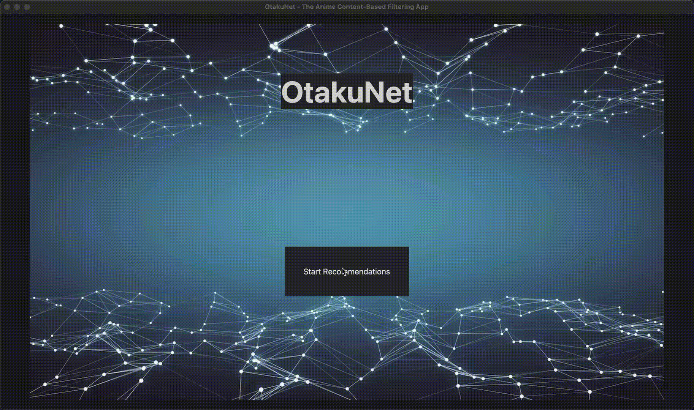

<h1 align= "center">OtakuNet</h1>

<div align="center">
  OtakuNet is an Content-Based Recommendation System App that recommends animes to users based on their personal ratings of genres. 
  Using only NumPy for faster linear algebra computations and Pandas for data organization, OtakuNet is trained on a neural network framework built from scratch. The model is trained using a dual neural network architecture to train both users and animes.
</div>

<br>



## How it Works
### ML Model
- Some feature engineering techniques, such as Bayesian Rating, weighted average, and z-score normalization applied to the data for training.
- Implements only NumPy to create a neural network framework from scratch, specifically tuned towards training a dual neural network architecture to take in anime and user data to make predictions. It first independently trains the user and anime as two independent neural networks, and then combines those new learned features together to make a final prediction. 
- Based on data of the features/genres of the animes and a new user input, the model uses this to compute a prediction of a recommended anime based on the user's genre ratings.
- Final trained parameters stored in pickle files to be accessed by the GUI app for predictions.

### GUI App
- Uses `customtkinter` framework to create the GUI elements
- Includes three screens: a Home screen, Prompt screen, and Recommend screen
- Prompt screen asks user for input values for their genre ratings.
- Recommend screen uses these inputs to compute a prediction, sort the highest predictions, and displays the recommended animes with their names, genres, and images.

<br>

## Installation

Clone this repository:
`https://github.com/kseto06/OtakuNet`

For model functionalities:
```
pip install numpy
pip install pandas
pip install pickle
```

Then, navigate to the gui folder from the parent (OtakuNet) directory:
```
cd gui
```

To run the app:

1) Install GUI dependencies
```
pip install -r requirements.txt
```

2) Activate the GUI environment:
```
source env/bin/activate
```

3) Run the app:
```
python app.py
```
